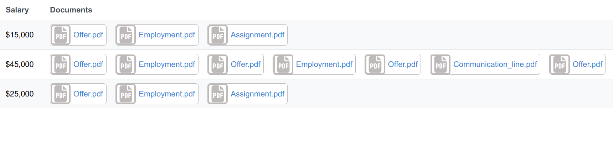
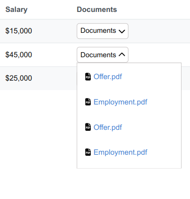

# File Table App
This is a mini application that displays different documents and salaries in a well formatted table.

## Built With

- NextJS
- React
- TypeScript
- CSS

## Live Demo

[Live Demo Link](https://henry-kc-salary-documents-app.herokuapp.com/)

## App Screenshots
### Desktop View


### Mobile View


## Getting Started
### Get A Local Copy And Run Application Locally
```bash
git clone https://github.com/HENRYKC24/Aerial-Ops-Challenge.git

cd Aerial-Ops-Challenge

npm install

npm run dev

# OR

yarn dev
```

Open [http://localhost:3000](http://localhost:3000) with your browser to see the result.

You can start editing the page by modifying `pages/index.tsx`. The page auto-updates as you edit the file.

## Test Application
```bash
npm test
```

## Author

👤 **Henry Kc**

- GitHub: [@githubhandle](https://github.com/henrykc24)
- Twitter: [@twitterhandle](https://twitter.com/henrykc24)
- LinkedIn: [LinkedIn](https://linkedin.com/in/henry-kc)


## 🤝 Contributing

Contributions, issues, and feature requests are welcome!

Feel free to check the [issues page](https://github.com/HENRYKC24/Aerial-Ops-Challenge/issues/).

## Show your support

Give a ⭐️ if you like this project!

## Acknowledgments
- A special thanks to [Aerial Ops](https://aerialops.io/) for availing me this wonderful opportunity to learn new technologies.

## 📝 License

This project is [MIT](./LICENSE) licensed.
